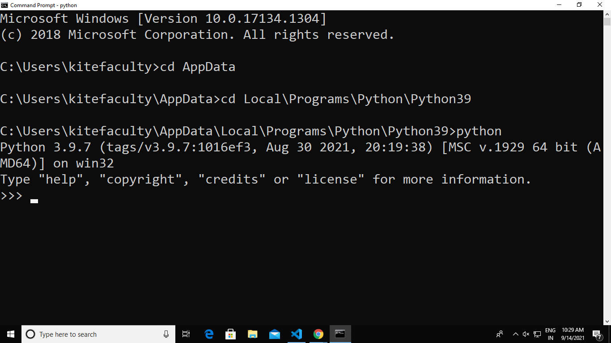
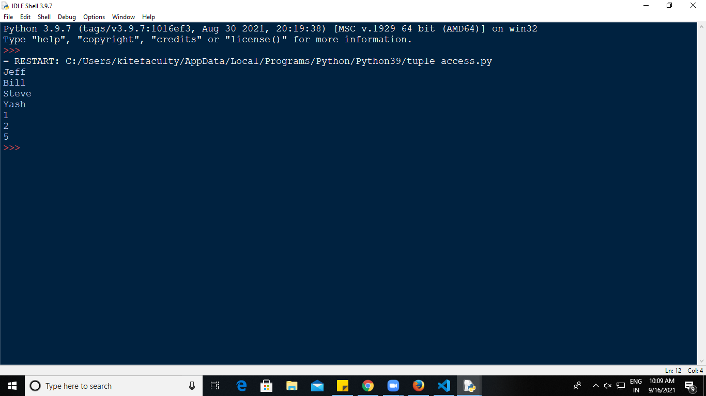

# **<div align="center"> GE8151 PROBLEM SOLVING AND PYTHON PROGRAMMING </div>**

## <div align="center">**UNIT II DATA, EXPRESSIONS, STATEMENTS**</div>
<div align="justify"><p><i>Python interpreter and interactive mode; values and types: int, float, boolean, string, and list; variables, expressions, statements, tuple assignment, precedence of operators, comments; modules and functions, function definition and use, flow of execution, parameters and arguments;</div></p></i>
<p><div align="justify"><b><i>Illustrative programs: exchange the values of two variables, circulate the values of n variables, distance between two points.</b></i></p>

https://www.memcode.com/courses/2312 - 50+ flashcards to review the contents of this unit.

https://github.com/Professor-Sathish/GE8151-UNIT-ILLUSTRATIVE-PROGRAMS/tree/master/unit%20-%202%20%20programs - List of Illustrative Programs in Unit 3.

>## **Table of Contents**
***
2.1. [Python interpreter and interactive mode](#python-interpreter)
- 2.1.1. [Introduction to Python](https://github.com/ProfessorAmbika/UNIT-2-DATA-EXPRESSIONS-STATEMENTS-MATERIAL/blob/main/md/DATA,%20EXPRESSIONS,%20STATEMENTS%20.md#introduction-to-python)
- 2.1.2. [Python Features](https://github.com/ProfessorAmbika/UNIT-2-DATA-EXPRESSIONS-STATEMENTS-MATERIAL/blob/main/md/DATA,%20EXPRESSIONS,%20STATEMENTS%20.md#python-features)
- [Python interpreter](https://github.com/ProfessorAmbika/UNIT-2-DATA-EXPRESSIONS-STATEMENTS-MATERIAL/blob/main/md/DATA,%20EXPRESSIONS,%20STATEMENTS%20.md#-python-interpreter)
- [Difference between Compiler and Interpreter](https://github.com/ProfessorAmbika/UNIT-2-DATA-EXPRESSIONS-STATEMENTS-MATERIAL/blob/main/md/DATA,%20EXPRESSIONS,%20STATEMENTS%20.md#-difference-between-compiler-and-interpreter)
- [Modes of Python Interpreter](https://github.com/ProfessorAmbika/UNIT-2-DATA-EXPRESSIONS-STATEMENTS-MATERIAL/blob/main/md/DATA,%20EXPRESSIONS,%20STATEMENTS%20.md#modes-of-python-interpreter)
    - [Interactive Mode](https://github.com/ProfessorAmbika/UNIT-2-DATA-EXPRESSIONS-STATEMENTS-MATERIAL/blob/main/md/DATA,%20EXPRESSIONS,%20STATEMENTS%20.md#1-interactive-mode)
        - [Advantages of Interactive Mode](https://github.com/ProfessorAmbika/UNIT-2-DATA-EXPRESSIONS-STATEMENTS-MATERIAL/blob/main/md/DATA,%20EXPRESSIONS,%20STATEMENTS%20.md#advantages-of-interactive-mode)
        - [Disadvantages of Interactive Mode](https://github.com/ProfessorAmbika/UNIT-2-DATA-EXPRESSIONS-STATEMENTS-MATERIAL/blob/main/md/DATA,%20EXPRESSIONS,%20STATEMENTS%20.md#disadvantages-of-interactive-mode)
    - [Script Mode](https://github.com/ProfessorAmbika/UNIT-2-DATA-EXPRESSIONS-STATEMENTS-MATERIAL/blob/main/md/DATA,%20EXPRESSIONS,%20STATEMENTS%20.md#2-script-mode)
        - [Advantages of Script Mode](https://github.com/ProfessorAmbika/UNIT-2-DATA-EXPRESSIONS-STATEMENTS-MATERIAL/blob/main/md/DATA,%20EXPRESSIONS,%20STATEMENTS%20.md#advantages-of-script-mode)
        - [Disadvantages of Script Mode](https://github.com/ProfessorAmbika/UNIT-2-DATA-EXPRESSIONS-STATEMENTS-MATERIAL/blob/main/md/DATA,%20EXPRESSIONS,%20STATEMENTS%20.md#disadvantages-of-script-mode)      

2.2. [Variables](https://github.com/ProfessorAmbika/UNIT-2-DATA-EXPRESSIONS-STATEMENTS-MATERIAL/blob/main/md/DATA,%20EXPRESSIONS,%20STATEMENTS%20.md#variables)
   - [Variable Naming Rules in Python](https://github.com/ProfessorAmbika/UNIT-2-DATA-EXPRESSIONS-STATEMENTS-MATERIAL/blob/main/md/DATA,%20EXPRESSIONS,%20STATEMENTS%20.md#variable-naming-rules-in-python) 
   - [How to Declare and use a Variable](https://github.com/ProfessorAmbika/UNIT-2-DATA-EXPRESSIONS-STATEMENTS-MATERIAL/blob/main/md/DATA,%20EXPRESSIONS,%20STATEMENTS%20.md#how-to-declare-and-use-a-variable)
   - [Re-declare a Variable](https://github.com/ProfessorAmbika/UNIT-2-DATA-EXPRESSIONS-STATEMENTS-MATERIAL/blob/main/md/DATA,%20EXPRESSIONS,%20STATEMENTS%20.md#re-declare-a-variable)
   - [Concatenate Variables](https://github.com/ProfessorAmbika/UNIT-2-DATA-EXPRESSIONS-STATEMENTS-MATERIAL/blob/main/md/DATA,%20EXPRESSIONS,%20STATEMENTS%20.md#concatenate-variables)
   - [Delete a variable](https://github.com/ProfessorAmbika/UNIT-2-DATA-EXPRESSIONS-STATEMENTS-MATERIAL/blob/main/md/DATA,%20EXPRESSIONS,%20STATEMENTS%20.md#delete-a-variable) 
    
2.3. [Values and Types](https://github.com/ProfessorAmbika/UNIT-2-DATA-EXPRESSIONS-STATEMENTS-MATERIAL/blob/main/md/DATA,%20EXPRESSIONS,%20STATEMENTS%20.md#values-and-types)
   - [Data Types](https://github.com/ProfessorAmbika/UNIT-2-DATA-EXPRESSIONS-STATEMENTS-MATERIAL/blob/main/md/DATA,%20EXPRESSIONS,%20STATEMENTS%20.md#data-types)
   - [Numeric Type](https://github.com/ProfessorAmbika/UNIT-2-DATA-EXPRESSIONS-STATEMENTS-MATERIAL/blob/main/md/DATA,%20EXPRESSIONS,%20STATEMENTS%20.md#numeric-type)
     - [Integers](https://github.com/ProfessorAmbika/UNIT-2-DATA-EXPRESSIONS-STATEMENTS-MATERIAL/blob/main/md/DATA,%20EXPRESSIONS,%20STATEMENTS%20.md#integers) 
     - [Float](https://github.com/ProfessorAmbika/UNIT-2-DATA-EXPRESSIONS-STATEMENTS-MATERIAL/blob/main/md/DATA,%20EXPRESSIONS,%20STATEMENTS%20.md#float)
     - [Complex Number](https://github.com/ProfessorAmbika/UNIT-2-DATA-EXPRESSIONS-STATEMENTS-MATERIAL/blob/main/md/DATA,%20EXPRESSIONS,%20STATEMENTS%20.md#complex-number)
   - [Boolean](https://github.com/ProfessorAmbika/UNIT-2-DATA-EXPRESSIONS-STATEMENTS-MATERIAL/blob/main/md/DATA,%20EXPRESSIONS,%20STATEMENTS%20.md#boolean)
   - [Sequence Type](https://github.com/ProfessorAmbika/UNIT-2-DATA-EXPRESSIONS-STATEMENTS-MATERIAL/blob/main/md/DATA,%20EXPRESSIONS,%20STATEMENTS%20.md#sequence-type)
     - [String](https://github.com/ProfessorAmbika/UNIT-2-DATA-EXPRESSIONS-STATEMENTS-MATERIAL/blob/main/md/DATA,%20EXPRESSIONS,%20STATEMENTS%20.md#string) 
     - [Escape Sequences](https://github.com/ProfessorAmbika/UNIT-2-DATA-EXPRESSIONS-STATEMENTS-MATERIAL/blob/main/md/DATA,%20EXPRESSIONS,%20STATEMENTS%20.md#escape-sequences)
     - [List](https://github.com/ProfessorAmbika/UNIT-2-DATA-EXPRESSIONS-STATEMENTS-MATERIAL/blob/main/md/DATA,%20EXPRESSIONS,%20STATEMENTS%20.md#list)
     - [Tuple](https://github.com/ProfessorAmbika/UNIT-2-DATA-EXPRESSIONS-STATEMENTS-MATERIAL/blob/main/md/DATA,%20EXPRESSIONS,%20STATEMENTS%20.md#tuple)
  
2.4. [Expressions](https://github.com/ProfessorAmbika/UNIT-2-DATA-EXPRESSIONS-STATEMENTS-MATERIAL/blob/main/md/DATA,%20EXPRESSIONS,%20STATEMENTS%20.md#expressions)

2.5. [Statements](https://github.com/ProfessorAmbika/UNIT-2-DATA-EXPRESSIONS-STATEMENTS-MATERIAL/blob/main/md/DATA,%20EXPRESSIONS,%20STATEMENTS%20.md#statements)

2.6. [Operators](https://github.com/ProfessorAmbika/UNIT-2-DATA-EXPRESSIONS-STATEMENTS-MATERIAL/blob/main/md/DATA,%20EXPRESSIONS,%20STATEMENTS%20.md#arithmetic-operators)
   - [Arithmetic operators](https://github.com/ProfessorAmbika/UNIT-2-DATA-EXPRESSIONS-STATEMENTS-MATERIAL/blob/main/md/DATA,%20EXPRESSIONS,%20STATEMENTS%20.md#arithmetic-operators)
   - [Comparison operators](https://github.com/ProfessorAmbika/UNIT-2-DATA-EXPRESSIONS-STATEMENTS-MATERIAL/blob/main/md/DATA,%20EXPRESSIONS,%20STATEMENTS%20.md#comparison-operators)
   - [Logical operators](https://github.com/ProfessorAmbika/UNIT-2-DATA-EXPRESSIONS-STATEMENTS-MATERIAL/blob/main/md/DATA,%20EXPRESSIONS,%20STATEMENTS%20.md#logical-operators)
   - [Bitwise operators](https://github.com/ProfessorAmbika/UNIT-2-DATA-EXPRESSIONS-STATEMENTS-MATERIAL/blob/main/md/DATA,%20EXPRESSIONS,%20STATEMENTS%20.md#bitwise-operators)
   - [Assignment operators](https://github.com/ProfessorAmbika/UNIT-2-DATA-EXPRESSIONS-STATEMENTS-MATERIAL/blob/main/md/DATA,%20EXPRESSIONS,%20STATEMENTS%20.md#assignment-operators)
   - [Special operators](https://github.com/ProfessorAmbika/UNIT-2-DATA-EXPRESSIONS-STATEMENTS-MATERIAL/blob/main/md/DATA,%20EXPRESSIONS,%20STATEMENTS%20.md#special-operators)
     - [Identity operators](https://github.com/ProfessorAmbika/UNIT-2-DATA-EXPRESSIONS-STATEMENTS-MATERIAL/blob/main/md/DATA,%20EXPRESSIONS,%20STATEMENTS%20.md#identity-operators)
     - [Membership operators](https://github.com/ProfessorAmbika/UNIT-2-DATA-EXPRESSIONS-STATEMENTS-MATERIAL/blob/main/md/DATA,%20EXPRESSIONS,%20STATEMENTS%20.md#membership-operators)

2.7. [Precedence of operators](https://github.com/ProfessorAmbika/UNIT-2-DATA-EXPRESSIONS-STATEMENTS-MATERIAL/blob/main/md/DATA,%20EXPRESSIONS,%20STATEMENTS%20.md#precedence-of-operators)

2.8. [Comments](https://github.com/ProfessorAmbika/UNIT-2-DATA-EXPRESSIONS-STATEMENTS-MATERIAL/blob/main/md/DATA,%20EXPRESSIONS,%20STATEMENTS%20.md#comments)
   - [Single-Line Comments in Python](https://github.com/ProfessorAmbika/UNIT-2-DATA-EXPRESSIONS-STATEMENTS-MATERIAL/blob/main/md/DATA,%20EXPRESSIONS,%20STATEMENTS%20.md#single-line-comments-in-python)
   - [Multi-Line Comments in Python](https://github.com/ProfessorAmbika/UNIT-2-DATA-EXPRESSIONS-STATEMENTS-MATERIAL/blob/main/md/DATA,%20EXPRESSIONS,%20STATEMENTS%20.md#multi-line-comments-in-python)

2.9. [Modules](https://github.com/ProfessorAmbika/UNIT-2-DATA-EXPRESSIONS-STATEMENTS-MATERIAL/blob/main/md/DATA,%20EXPRESSIONS,%20STATEMENTS%20.md#modules)

2.10. [Functions](https://github.com/ProfessorAmbika/UNIT-2-DATA-EXPRESSIONS-STATEMENTS-MATERIAL/blob/main/md/DATA,%20EXPRESSIONS,%20STATEMENTS%20.md#functions)

2.11. [Function Definition and Use](https://github.com/ProfessorAmbika/UNIT-2-DATA-EXPRESSIONS-STATEMENTS-MATERIAL/blob/main/md/DATA,%20EXPRESSIONS,%20STATEMENTS%20.md#function-definition-and-use)

2.12. [Flow of Execution](https://github.com/ProfessorAmbika/UNIT-2-DATA-EXPRESSIONS-STATEMENTS-MATERIAL/blob/main/md/DATA,%20EXPRESSIONS,%20STATEMENTS%20.md#flow-of-execution)

2.13. [Parameters and Arguments](https://github.com/ProfessorAmbika/UNIT-2-DATA-EXPRESSIONS-STATEMENTS-MATERIAL/blob/main/md/DATA,%20EXPRESSIONS,%20STATEMENTS%20.md#parameters-and-arguments)

>## **Online References**
* Understand types of [operators](https://www.geeksforgeeks.org/python-operators/) and [precedence](https://www.geeksforgeeks.org/precedence-and-associativity-of-operators-in-python/)
* List of [datatypes](https://www.analyticsvidhya.com/blog/2021/08/data-types-in-python-you-need-to-know-at-the-beginning-of-your-data-science-journey/)
* Create [functions](https://www.analyticsvidhya.com/blog/2021/07/all-fundamentals-of-python-functions-that-you-should-know-a-quick-brush-up/)
    
>## **Pre – Unit Exercise**
***
<div align="justify"><p>Practice on writing algorithms and pseudocode for various problems. </div></p>

>## **Post – Unit Exercise**
***
* <div align="justify"><p>Solve various complex mathematical expressions through python programming. </div></p>
* <p><div align="justify">Implement simple applications through functions and modules. </div></p>
* <p><div align="justify"> Solve various levels of MCQ in data types, values and functions.</div></p>
>## **Key Terms**
***
* <p><div align="justify"><b><i>Interpreter</b></i>: An interpreter is a computer program that is used to directly execute program instructions written using one of the many high-level programming languages. </div></p>
* <p><div align="justify"><b><i>Data types</b></i> are the classification or categorization of data items. It represents the kind of value that tells what operations can be performed on a particular data. </div></p>
* <div align="justify"><b><i><p>Variables</b></i> are reserved memory locations to store values. Based on the data type of a variable, the interpreter allocates memory and decides what can be stored in the reserved memory. </div></p>
* <p><div align="justify"><b><i>Tuple</b></i> is a collection of objects which ordered and immutable. Creating a tuple is as simple as putting different comma-separated values. </div></p>
* <p><div align="justify"><b><i>Comments</b></i> in Python are the lines in the code that are ignored by the compiler during the execution of the program. Comments enhance the readability of the code and help the programmers to understand the code very carefully. </div></p>
* <p><div align="justify"><b><i>Operators</b></i>in general are used to perform operations on values and variables. These are standard symbols used for the purpose of logical and arithmetic operations. </div></p>
* <p><div align="justify"><b><i>Operator precedence</b></i> determines how operators are parsed concerning each other. Operators with higher precedence become the operands of operators with lower precedence. </div></p>
* <p><div align="justify"><b><i>Function</b></i> is a block of organized, reusable code that is used to perform a single, related action. Functions provide better modularity for your application and a high degree of code reusing.   </div></p>

>## **Python Interpreter**
***
## **Introduction to Python**
<p><div align="justify">Python is an interpreted high-level general-purpose programming language. Its design philosophy emphasizes code readability with its use of significant indentation.</div></p>

<div align="justify">It was created by Guido van Rossum during <b><i>1985-1990</b></i>. Python got its name from <b><i>“Monty Python’s flying circus”</b></i>. Python was released in the year 2000.</div>

* <p><div align="justify"><b><i>Python is interpreted: </b></i> Python is processed at runtime by the interpreter. You do not need to compile your program before executing it. </div></p>
* <p><div align="justify"><b><i>Python is Interactive: </b></i> You can actually sit at a Python prompt and interact with the interpreter directly to write your programs. </div></p>
* <p><div align="justify"><b><i>Python is Object-Oriented: </b></i> Python supports Object-Oriented style or technique of programming that encapsulates code within objects. </div></p>
* <p><div align="justify"><b><i>Python is a Beginner's Language: </b></i> Python is a great language for the beginner- Level programmers and supports the development of a wide range of applications.</div> </p>
## **Python Features**
* <p><div align="justify"> <b><i>Easy-to-learn: </b></i> Python is clearly defined and easily readable. The structure of the program is very simple. It uses few keywords. </div></p>
* <p><div align="justify"> <b><i>Easy-to-maintain:</b></i> Python's source code is fairly easy-to-maintain. </p></div>
* <p><div align="justify"> <b><i>Portable:</b></i> Python can run on a wide variety of hardware platforms and has the same interface on all platforms. </div></p>
* <p><div align="justify"><b><i>Interpreted:</b></i> Python is processed at runtime by the interpreter. So, there is no need to compile a program before executing it. You can simply run the program. </div></p>
* <p><div align="justify"><b><i>Extensible:</b></i> Programmers can embed python within their C, C++, JavaScript, ActiveX, etc.</div></p> 
* <p><div align="justify"><b><i>Free and Open Source: </b></i> Anyone can freely distribute it, read the source code, and edit it. </div></p>
* <p><div align="justify"><b><i> High Level Language: </b></i> When writing programs, programmers concentrate on solutions of the current problem, no need to worry about the low level details. </div></p>
* <p><div align="justify"><b><i>Scalable:</b></i> Python provides a better structure and support for large programs than shell scripting.</div></p>

## **Python interpreter**
<p><div align="justify"> <b><i>Interpreter:</b></i> An interpreter is a translator (computer program) that repeatedly reads instructions (one at a time) and translates them to machine code. It then executes instructions written in a programming or scripting language, without requiring them previously to have been compiled into a machine language program. </div></p>

<div align="justify"> <b><i>Compiler:</b></i> To translate a program written in a high-level language into a low-level language all at once, in preparation for later execution. </div> </p>


## **Difference between Compiler and Interpreter**
|<div align="center"> Compiler </div> |<div align="center"> Interpreter </div> |
| --- | ----------- |
| <div align="justify"> Scans the entire program and translates it as a whole into machine code. </div> | <div align="justify">Translates program one statement at a time. </div>|
| <div align="justify"> It takes large amount of time to analyze the source code but the overall execution time is comparatively faster. </div> | <div align="justify"> It takes less amount of time to analyze the source code but the overall execution time is slower. </div> |
| <div align="justify"> Generates intermediate object code which further requires linking, hence requires more memory. </div> | <div align="justify"> No intermediate object code is generated, hence are memory efficient. </div> |
| <div align="justify"> It generates the error message only after scanning the whole program. Hence debugging is comparatively hard. </div> | <div align="justify"> Continues translating the program until the first error is met, in which case it stops. Hence debugging is easy. </div>|
| <div align="justify"> Programming language like C, C++ uses compilers. </div> | <div align="justify"> Programming languages like Python, Ruby use interpreters. </div> |
## **Modes of Python Interpreter** 
Python has two basic modes: script and interactive.

###  **_1. Interactive Mode:_**
<p><div align="justify">Interactive mode is a command line shell which gives immediate feedback for each statement, while running previously fed statements in active memory. As new lines are fed into the interpreter, the fed program is evaluated both in part and in whole.</div></p>
<p><div align="justify">The code executes via the Python shell, which comes with Python installation. Interactive mode is handy when you just want to execute basic Python commands or you are new to Python programming. </div></p>
<p><div align="justify">To access the Python shell, open the terminal of your operating system and then type "python". Press the enter key and the Python shell will appear.</div></p>



<p><div align="justify"> The >>> indicates that the Python shell is ready to execute and send your commands to the Python interpreter. The result is immediately displayed on the Python shell as soon as the Python interpreter interprets the command. </div></p>
<p><div align="justify">To run your Python statements, just type them and hit the enter key. You will get the results immediately, unlike in script mode. For example, to print the text "Hello World", we can type the following:</div></p>

```python
>>> print("Hello World")
Hello World
```

```python
>>> 10
10
>>> print(5*20)
100
>>> "hi" * 5
'hihihihihi'
>>>
``` 
<div align="justify"> It is possible to run multiple Python statements without having to create and save a script. You can also copy your code from another source then paste it on the Python shell. </div>

```python
>>> the_world_is_flat = True
>>> if the_world_is_flat:
        print("Be careful not to fall off!")

Be careful not to fall off
```
### <b><i>Advantages of Interactive Mode</b></i>
* <p><div align="justify"> Helpful when the script is extremely short and wants immediate results. </div></p>
* <p><div align="justify"> Faster as you only have to type a command and then press the enter key to get the results. </div></p>
* <p><div align="justify"> Good for beginners who need to understand Python basics. </div></p>
### **_Disadvantages of Interactive Mode_**
* <p><div align="justify"> Editing the code in interactive mode is hard to move back to the previous commands or else the whole command has to be rewritten again. </div></p>
* <p><div align="justify"> It's very tedious to run long pieces of code. </div><p>
### **_2. Script Mode:_**
<p><div align="justify"> In script mode, we type python program in a file and then use interpreter to execute the content of the file. Scripts can be saved to disk for future use. Python scripts have the extension .py, meaning that the filename ends with     <i><b>.py</i></b>. Save the code with <i><b>filename.py</i></b> and run the interpreter in script mode to execute the script. </div></p>
<p><div align="justify"> In the standard Python shell, click <i><b>"File"</i></b> then choose <i><b>"New"</i></b> or simply hit <i><b>"Ctrl + N"</i></b> on your keyboard to open a blank script in which you can write your code. You can then press <i><b>"Ctrl + S"</i></b> to save it. </div><p>
<p><div align="justify"> After writing your code, run it by clicking <i><b>"Run"</i></b> then "Run Module" or simply <i><b>press F5</i></b>. </div><p>


### **_Advantages of Script Mode_**
* It is easy to run large pieces of code.
* Editing your script is easier in script mode.
* Good for both beginners and experts.
### **_Disadvantages of Script Mode_**
* Can be tedious when you need to run only a single or a few lines of code.
* Must create and save a file before executing your code.
>## **Variables**
***
<p><div align="justify">A Python variable is a reserved memory location to store values. In other words, a variable in a python program gives data to the computer for processing.</div></p>
<p><div align="justify">Every value in Python has a datatype. Different data types in Python are Numbers,
List, Tuple, Strings, Dictionary, etc. Variables can be declared by any name. </p></div>

## **_Variable Naming Rules in Python_** 
* <p><div align="justify"> Variable name should start with letter(a-zA-Z) or underscore ( _ ). </p></div> <b>Valid : age , _age , Age <p>Invalid : 1age</p></b>
* <p><div align="justify">In variable name, no special characters allowed other than underscore ( _ ). </p></div> <b>Valid : age_ , _age <p>Invalid : age_*</p></b>
* <p><div align="justify">Variables are case sensitive.</p> </div><b><i>age</i> and <i>Age</i> are different, since variable names are case sensitive</b>
* <p><div align="justify">Variable name can have numbers but not at the beginning.</p></div> <b>Example: Age1</b>
* <p><div align="justify">Variable name should not be a Python keyword. Keywords are also called as reserved words.</p></div> <b>Example: pass, break, continue.. etc are reserved for special meaning in Python. So, we should not declare keyword as a variable name. </b>
## **_How to Declare and use a Variable_** 
<p><div align="justify">Let see an example. We will declare variable "a" and print it</div></p>

```python
>>>number=100
>>>print(number)
```
**Output**
```
100
```

## **_Re-declare a Variable_** 
<p><div align="justify">You can re-declare the variable even after you have declared it once.</p></div>

```python
>>>variable=100
>>>print(variable)
>>>variable=’Python’
>>>print(variable)
```
**Output**
```
100 
Python
```

## **_Concatenate Variables_**
```python
>>>string1='ABS'
>>>number=1
>>>print(string1+number)
```
**Output**
```python
Traceback (most recent call last):
  File "<pyshell#2>", line 1, in <module>
    print(a+b)
TypeError: can only concatenate str (not "int") to str
```
```python
>>> string1='ABS'
>>> number=1
>>> print(string1+str(number))
```
**Output**
```
ABS1
```
## **_Delete a variable_**
<p><div align="justify">It is possible to delete variable using the command del "variable name".</p></div>


>## **Values and Types**
***
## **Data Types**
<p><div align="justify">Data types are the <i>classification or categorization of data items</i>. Python supports the following built-in data types</div></p>

* Numeric
* Sequence Type
* Boolean
* Set
* Dictionary


## **Numeric Type**
## **_Integers_**
<p><div align="justify">This value is represented by int class. It contains positive or negative whole numbers (without fraction or decimal). In Python there is no limit to how long an integer value can be. The followings are valid integer literals in Python.</p></div>

``` python
>>> 0
0
>>> 100
100
>>> -10
10
>>> 1234567890
1234567890
>>>y=5000000000000000000000000000000000000000000000000000000
>>>y
5000000000000000000000000000000000000000000000000000000
```

<p><div align="justify">Integers can be binary, octal, and hexadecimal values.</p><div>

```python
>>> 0b11011000 # binary
216
>>> 0o12 # octal
10
>>> 0x12 # hexadecimal
15
```
<p><div align="justify">All integer literals or variables are objects of the int class. Use the type() method to get the class name, as shown below.</p></div>

```python
>>>type(100)
<class 'int'> 

>>> num=1234567890
>>> type(num)
<class 'int'> 

>>>num=5000000000000000000000000000000000000000000000000000000
>>> type(num) 
<class 'int'>
```
<p><div align="justify">Leading zeros in non-zero integers are not allowed e.g. 000123 is invalid number, 0000 is 0.</p></div>

```python
>>> 01234
  File "<stdin>", line 1
    01234
        ^
SyntaxError: leading zeros in decimal integer literals are not permitted; use an 0o prefix for octal integers
```
<p><div align="justify">Python does not allow comma as number delimiter. Use underscore _ as a delimiter instead.</p></div>

```python
>>> num_x=1_234_567_890
>>> num_x
1234567890
```
<p><div align="justify">The <b><i>int( )</b></i> function converts a string or float to int.</p></div>

```python
>>> int('100')
100
>>> int('-10')
-10
>>> int('5.5')
5
>>> int('100', 2)
4
```
## **_Float_**
<p><div align="justify"> In Python, floating point numbers (float) are positive and negative real numbers with a fractional part denoted by the decimal symbol . or the scientific notation E or e, <b>e.g. 1234.56, 3.142, -1.55, 0.23.</b></p></div>

```python
>>> float_num=3.12
>>> float_num
3.12
>>> type(float_num)
<class 'float'>
```
<p><div align="justify">Floats can be separated by the underscore _, <b>e.g. 123_42.222_013</b> is a valid float.</p> </div>

```python
>>> float_num=123_42.222_013
>>> float_num
12342.222013
```
<p><div align="justify">Floats has the maximum size depends on your system. The float beyond its maximum size referred as <b>"inf", "Inf", "INFINITY", or "infinity".</b> <b> Float 2e400</b> will be considered as infinity for most systems.</p> </div>

```python
>>> float_num=2e400
>>> float_num
inf
```
## **_Complex Number_**
<p><div align="justify">A complex number is a number with real and imaginary components. For example, 5 + 6j is a complex number where 5 is the real component and 6 multiplied by j is an imaginary component.</p></div>

```python
>>> complex_num=7+3j
>>> complex_num
(7+3j)

>>> type(complex_num)
<class 'complex'>
```
<p><div align="justify">You must use <b>j or J</b> as imaginary component. Using other character will throw syntax error.</p></div>

```python
>>> complex_num=5+2k
SyntaxError: invalid syntax

>>> complex_num=5+j
SyntaxError: invalid syntax

>>> complex_num=5j+2j
SyntaxError: invalid syntax
```
## **Boolean**
<p><div align="justify">Data type with one of the two built-in values, True or False. Boolean objects that are equal to True are truthy (true), and those equal to False are falsy (false). But non-Boolean objects can be evaluated in Boolean context as well and determined to be true or false. It is denoted by the <b><i>class bool</b></i>.True and False with capital <b><i>‘T’ and ‘F’</b></i> are valid booleans otherwise python will throw an error.</p></div>

```python
>>>print(type(True))
<class 'bool'>

>>>print(type(False))
<class 'bool'>

print(type(true))
Traceback (most recent call last):
  File "<stdin>", line 1, in <module>
NameError: name 'true' is not defined
```

## **Sequence Type**
<p><div align="justify">In Python, sequence is the ordered collection of similar or different data types. Sequences allows to store multiple values in an organized and efficient fashion. There are several sequence types in Python</p></div>

* String
* List
* Tuple
## **_String_**
<p><div align="justify">In Python, string is an immutable sequence data type. It is the sequence of Unicode characters wrapped inside single, double, or triple quotes.</p></div>

```python
'This is a string in Python' # string in single quotes
"This is a string in Python" # string in double quotes
'''This is a string in Python''' # string in triple quotes
"""This is a string in Python""" # string in triple double-quotes
```
**Example:** https://replit.com/@ErAmbikaM/String1#main.py

<p><div align="justify">Multi-line strings must be embed in triple quotes, as shown below.</p></div>

**Example:** https://replit.com/@ErAmbikaM/Multiline-String#main.py

<p><div align="justify">Use the len() function to retrieve the length of a string, as shown below.</p></div>

```python
>>> wish='Hello'
>>> len(wish)
5
```
<p><div align="justify">In Python, individual characters of a String can be accessed by using the method of Indexing. </p></div>


```python
>>> wish='Hello'
>>> wish[0]
'H'
>>> wish[1]
'e'
>>> wish[4]
'o'
>>> wish[5]
Traceback (most recent call last):
  File "<pyshell#6>", line 1, in <module>
    wish[5]
IndexError: string index out of range
```
<p><div align="justify">Indexing allows negative address references to access characters from the back of the String, e.g. -1 refers to the last character, -2 refers to the second last character and so on.</p></div>

```python
>>> wish='Hello'
>>> wish[-5]
'H'
>>> wish[-2]
'l'
>>> wish[-3]
'l'
>>> wish[-6]
Traceback (most recent call last):
  File "<pyshell#13>", line 1, in <module>
    wish[-6]
IndexError: string index out of range 
```
<p><div align="justify">The string is an immutable object. Hence, it is not possible to modify it. The attempt to assign different characters at a certain index results in errors.</p></div>

```python
>>> wish='hello'
>>> wish[0]='B'
Traceback (most recent call last):
  File "<pyshell#26>", line 1, in <module>
    wish[0]='B'
TypeError: 'str' object does not support item assignment
```
<p><div align="justify">All strings are objects of the <b><i>str class</b></i> in Python.

```python
>>> wish='hello'
>>> type(wish)
<class 'str'>
```
### **_Escape Sequences_**
<p><div align="justify">The escape character is used to invoke an alternative implementation of the subsequent character in a sequence.</p></div>

```python
>>> string1='Welcome to \'Python Tutorial\' '
>>> print(string1)
Welcome to 'Python Tutorial' 

>>> string1='Welcome to \"Python Tutorial\" '
>>> print(string1)
Welcome to "Python Tutorial" 
```
| <div align="center">Escape Sequence</div> | <div align="center">Description </div> | <div align="center">Example</div> |
| ----------- | ----------- | ----------- |
| <div align="center"> \\\ </div> | <div align="center">Backslash </div>| <div>>>> "Hello\\Hi"</div> Hello\Hi   | 
| <div align="center"> \b </div> | <div align="center">Backspace </div>| <div>>>> "ab\bc"</div> ac | 
| <div align="center"> \f </div> | <div align="center">Form feed </div>|  | 
| <div align="center"> \n </div> | <div align="center">Newline </div>| <div>>>> "hello\nworld"</div> <div>Hello </div>world | 
| <div align="center"> \nnn </div> | <div align="center">Octal notation, where n is in the range 0-7 </div>| <div>>>> '\101'</div> A | 
| <div align="center"> \t </div> | <div align="center">Tab </div>| <div> >>>'Hello\tPython'</div> Hello &nbsp; &nbsp; &nbsp; &nbsp; Python |
| <div align="center"> \xnn </div> | <div align="center">Hexadecimal notation, where n is in the range 0-9, a-f, or A-F </div>| <div> >>> '\x48\x69'</div> Hi |
| <div align="center"> \onn </div> | <div align="center">Octal notation, where n is in the range 0-9 </div>| <div> >>> "\110\151"</div> Hi 
## **_List_**
<p><div align="justify">Lists are just like the arrays, declared in other languages which is a ordered collection of data. It is very flexible as the items in a list do not need to be of the same type.</div></p>

**Creating a List :**
Lists in Python can be created by just placing the sequence inside the square brackets[ ].

**Example:** https://replit.com/@ErAmbikaM/List1#main.py

<p><div align="justify">A list can contain unlimited data depending upon the limitation of your computer's memory.</div></p>

```python
number=[1,2,3,4,5,6,7,8,9,10,11,12,13,14,15,16,17,18,19,20, 21,22,23,24,25,26,27,28,29,30,31,32,33,34,35,36,37,38,39,40,41,42,43,44,45,46,47,48,49,50,51,52,53,54,55,56,57,58,59,60]
```
<p><div align="justify">List items can be accessed using a zero-based index in the square brackets [ ]. Indexes start from zero and increment by one for each item. Accessing an item using a large index than the list's total items would result in IndexError. </div></p>

**Example:** https://replit.com/@ErAmbikaM/accessinglist#main.py

<p><div align="justify">A list can contain multiple inner lists as items that can be accessed using indexes.</p></div>

**Example:** https://replit.com/@ErAmbikaM/innerlist#main.py
## **_Tuple_**
<p><div align="justify">Tuple is an immutable (unchangeable) collection of elements of different data types. It is an ordered collection, so it preserves the order of elements in which they were defined.</p></div>
<p><div align="justify">Tuples are defined by enclosing elements in parentheses ( ), separated by a comma. The following declares a tuple type variable. </p></div>

**Example: Tuple Variable Declaration and assignment**
```python
empty_tuple=() # empty tuple
print(empty_tuple)

names = ('Jeff', 'Bill', 'Steve', 'Yash') # string tuple
print(names)

nums = (1, 2, 3, 4, 5) # int tuple
print(nums)

hetero_tuple=(1, 'Steve', True, 25, 12000)  # heterogeneous data tuple
print(hetero_tuple)
```
**Output**


<p><div align="justify">It is not necessary to enclose the tuple elements in parentheses. The tuple object can include elements separated by a comma without parentheses.</div></p>

```python
names = 'Jeff', 'Bill', 'Steve', 'Yash' # string tuple
print(names)

nums = 1, 2, 3, 4, 5 # int tuple
print(nums)

hetero_tuple=1, 'Steve', True, 25, 12000  # heterogeneous data tuple
print(hetero_tuple)
```
**Output**

<p><div align="justify">Tuples cannot be declared with a single element unless followed by a comma.</div></p>

```python
names = ('Jeff') # considered as string type
print(names)
print(type(names))

names = ('Jeff',) # tuple with single element
print(names)
print(type(names))
```
**Output**


**Access Tuple Elements**
<p><div align="justify">Each element in the tuple is accessed by the index in the square brackets [ ]. An index starts with zero and ends with (number of elements - 1), as shown below.</p></div>

**Example**
```python
names = ('Jeff', 'Bill', 'Steve', 'Yash') 
print(names[0]) 
print(names[1]) 
print(names[2]) 
print(names[3]) 

nums = (1, 2, 3, 4, 5) 
print(nums[0]) 
print(nums[1]) 
print(nums[4]) 
```
**Output**


<p><div align="justify">The tuple supports negative indexing also, the same as list type. The negative index for the first element starts from -number of elements and ends with -1 for the last element.</p></div>

**Example**
```python
names = ('Jeff', 'Bill', 'Steve', 'Yash') 
print(names[-4]) 
print(names[-3]) 
print(names[-2]) 
print(names[-1]) 
```
**Output**


<p><div align="justify">Tuple elements can be unpacked and assigned to variables, as shown below. However, the number of variables must match with the number of elements in a tuple; otherwise, an error will be thrown.</p></div>

**Example**
```python
names = ('Jeff', 'Bill', 'Steve', 'Yash') 
a, b, c, d = names # unpack tuple
print(a, b, c, d)
```
**Output**

## **Dictionary**
<p><div align="justify"> Dictionary in Python is an unordered collection of data values, used to store data values like a map, which, unlike other Data Types that hold only a single value as an element, Dictionary holds key:value pair. Key-value is provided in the dictionary to make it more optimized.</p></div>
<p><div align="justify">In Python, a Dictionary can be created by placing a sequence of elements within curly <b>{ } braces</b>, separated by <b>‘comma’</b>. Dictionary holds a pair of values, one being the Key and the other corresponding pair element being its <b>Key:value</b>. Values in a dictionary can be of any data type and can be duplicated, whereas keys can’t be repeated and must be immutable.</p></div> 

```python
# Creating an empty Dictionary
Dict = {}
print("Empty Dictionary: ")
print(Dict)
 
# Creating a Dictionary
# with dict() method
Dict = dict({1: 'Python', 2: 'For', 3:'Beginners'})
print("\nDictionary with the use of dict(): ")
print(Dict)
 
# Creating a Dictionary
# with each item as a Pair
Dict = dict([(1, 'Python'), (2, 'Data Science')])
print("\nDictionary with each item as a pair: ")
print(Dict)

# accessing a element using key
Dict = dict([(1, 'Python'), (2, 'Data Science')])
print("Accessing a element using key:")
print(Dict[1])
```
**Output**


## **Set**
<p><div align="justify">A Set is an unordered collection data type that is iterable, mutable and has no duplicate elements. Python’s set class represents the mathematical notion of a set. </p></div>
<p><div align="justify">The major advantage of using a set, as opposed to a list, is that it has a highly optimized method for checking whether a specific element is contained in the set. This is based on a data structure known as a hash table. Since sets are unordered, we cannot access items using indexes like we do in lists.</p></div>

```python
# Python program to
# demonstrate sets
  
# Same as {"a", "b", "c"}
myset = set(["a", "b", "c"])
print(myset)
  
# Adding element to the set
myset.add("d")
print(myset)
```
**Output**
```
{'c', 'b', 'a'}
{'d', 'c', 'b', 'a'}
```


>## **Statements**
***
<p><div align="justify">
Instructions written in the source code for execution are called statements. There are different types of statements in the Python programming language like Assignment statements, Conditional statements, Looping statements, etc. These all help the user to get the required output. For example, n = 50 is an assignment statement. </p></div>
<b><p><div align="justify">Multi-Line Statements:</b> Statements in Python can be extended to one or more lines using parentheses (), braces {}, square brackets [], semi-colon (;), continuation character slash (\). When the programmer needs to do long calculations and cannot fit his statements into one line, one can make use of these characters.  </p></div>

**Example**
```python
#Declared using Continuation Character (\):
s = 1 + 2 + 3 + \
    4 + 5 + 6 + \
    7 + 8 + 9

#Declared using parentheses () :
n = (1 * 2 * 3 + 7 + 8 + 9)

#Declared using square brackets [] :
footballer = ['MESSI',
          'NEYMAR',
          'SUAREZ']

#Declared using braces {} :
x = {1 + 2 + 3 + 4 + 5 + 6 +
     7 + 8 + 9}

#Declared using semicolons(;) :
flag = 2; ropes = 3; pole = 4
```
>## **Operators**
***
<p><div align="justify">Operators are special symbols in Python that carry out arithmetic or logical computation. The value that the operator operates on is called the operand.</p></div>

## **_Arithmetic operators_**
<p><div align="justify">Arithmetic operators are used to perform mathematical operations like addition, subtraction, multiplication, etc.</p></div>

| <div align="center">Operator</div> | <div align="center">Meaning</div> | <div align="center">Example</div> |
| ----------- | ----------- | ----------- |
| <div align="center"> + </div> | <div align="justify">Add two operands or unary plus </div>| <div align="center">x + y + 2</div>  |
| <div align="center"> - </div> | <div align="justify">Subtract right operand from the left or unary minus </div>| <div align="center">x - y - 2</div>  |
| <div align="center"> * </div> | <div align="justify">Multiply two operands </div>|<div align="center"> x * y </div> |
| <div align="center"> / </div> | <div align="justify">Divide left operand by the right one (always results into float) </div>|<div align="center"> x / y </div>|
| <div align="center"> % </div> | <div align="justify">Modulus - remainder of the division of left operand by the right </div>|<div align="center"> x % y (remainder of x/y) </div> |
| <div align="center"> // </div> | <div align="justify">Floor division - division that results into whole number adjusted to the left in the number line </div>|<div align="center"> x // y </div>|
| <div align="center"> ** </div> | <div align="justify">Exponent - left operand raised to the power of right </div>|<div align="center"> x**y (x to the power y) </div> |

**Example:** https://replit.com/@ErAmbikaM/arithmeticoperator#main.py
## **_Comparison operators_**
<p><div align="justify">Comparison operators are used to compare values. It returns either True or False according to the condition.</p></div>

| <div align="center">Operator</div> | <div align="center">Meaning</div> | <div align="center">Example</div> |
| ----------- | ----------- | ----------- |
| <div align="center"> > </div> | <div align="justify">Greater than - True if left operand is greater than the right </div>| <div align="center">x > y </div> |
| <div align="center"> < </div> | <div align="justify">Less than - True if left operand is less than the right </div>| <div align="center">x < y </div> |
| <div align="center"> == </div> | <div align="justify">Equal to - True if both operands are equal </div>| <div align="center">x == y </div> |
| <div align="center"> != </div> | <div align="justify">Not equal to - True if operands are not equal </div>|<div align="center"> x != y </div> |
| <div align="center"> >= </div> | <div align="justify">Greater than or equal to - True if left operand is greater than or equal to the right </div>| <div align="center">x >= y </div> |
| <div align="center"> <= </div> | <div align="justify">Less than or equal to - True if left operand is less than or equal to the right </div>|<div align="center"> x <= y </div> |

**Example:** https://replit.com/@ErAmbikaM/Comparisonoperator#main.py

## **_Logical operators_**
<p><div align="justify">Logical operators are the and, or, not operators.</p></div>

| <div align="center">Operator</div> | <div align="center">Meaning</div> | <div align="center">Example</div> |
| ----------- | ----------- | ----------- |
| <div align="center">and </div> | <div align="justify">True if both the operands are true </div>| <div align="center">x and y</div> |
| <div align="center">or </div> | <div align="justify">True if either of the operands is true </div>| <div align="center">x or y</div> |

**Example:** https://replit.com/@ErAmbikaM/Logicaloperator#main.py

## **_Bitwise operators_**
<p><div align="justify">Bitwise operators act on operands as if they were strings of binary digits. They operate bit by bit, hence the name.</p></div>
<p><div align="justify">In the table below: Let x = 10 (0000 1010 in binary) and y = 4 (0000 0100 in binary)</p></div>

| <div align="center">Operator</div> | <div align="center">Meaning</div> | <div align="center">Example</div> |
| ----------- | ----------- | ----------- |
| <div align="center">& </div> | <div align="justify">Bitwise AND </div>|<div align="center"> x & y = 0 (0000 0000)</div> |
| <div align="center">\|</div> | <div align="justify">Bitwise OR </div>| <div align="center">x \| y = 14 (0000 1110) </div>|
| <div align="center">~</div> | <div align="justify">Bitwise NOT </div>|<div align="center"> ~x = -11 (1111 0101)</div> |
| <div align="center">^</div> | <div align="justify">Bitwise XOR </div>| <div align="center">x ^ y = 14 (0000 1110)</div> |
| <div align="center">>></div> | <div align="justify">Bitwise right shift </div>| <div align="center">x >> 2 = 2 (0000 0010) </div>|
| <div align="center"><<</div> | <div align="justify">Bitwise left shift </div>|<div align="center"> x << 2 = 40 (0010 1000)</div> |
## **_Assignment operators_**
<p><div align="justify">Assignment operators are used in Python to assign values to variables. a = 5 is a simple assignment operator that assigns the value 5 on the right to the variable a on the left.</p></div>

| <div align="center">Operator</div> | <div align="center">Meaning</div> | <div align="center">Example</div> |
| ----------- | ----------- | ----------- |
| <div align="center">= </div> | <div align="center">x = 5 </div>|<div align="center"> x = 5 </div> |
| <div align="center">+= </div> | <div align="center">x += 5 </div>|<div align="center"> x = x + 5 </div> |
| <div align="center">-= </div> | <div align="center"> x -= 5 </div>|<div align="center"> x = x - 5 </div> |
| <div align="center">*= </div> | <div align="center"> x *= 5 </div>|<div align="center"> x = x * 5 </div> |
| <div align="center">/= </div> | <div align="center"> x /= 5 </div>|<div align="center"> x = x / 5 </div> |
| <div align="center">%=</div> | <div align="center"> x %= 5 </div>|<div align="center"> x = x % 5 </div> |
| <div align="center">//=</div> | <div align="center"> x //= 5 </div>|<div align="center"> x = x // 5 </div> |
| <div align="center">**=</div> | <div align="center"> x **= 5 </div>|<div align="center"> x = x ** 5 </div> |
| <div align="center">&=</div> | <div align="center"> x &= 5 </div>|<div align="center"> x = x & 5 </div> |
| <div align="center">\|=</div> | <div align="center"> x \|= 5 </div>|<div align="center"> x = x \| 5 </div> |
| <div align="center">^=</div> | <div align="center"> x ^= 5 </div>|<div align="center"> x = x ^ 5 </div> |
| <div align="center">>>=</div> | <div align="center"> x >>= 5 </div>|<div align="center"> x = x >> 5 </div> |
| <div align="center"><<=</div> | <div align="center"> x <<= 5</div>|<div align="center"> x = x << 5</div> |
## **_Special operators_**
<p><div align="justify">Python language offers some special types of operators like the identity operator or the membership operator. </p></div>

### **_Identity operators_**
<p><div align="justify"> <b>is and is not</b> are the identity operators in Python. They are used to check if two values (or variables) are located on the same part of the memory. Two variables that are equal does not imply that they are identical.

| <div align="center">Operator</div> | <div align="center">Meaning</div> | <div align="center">Example</div> |
| ----------- | ----------- | ----------- |
| <div align="center">is </div> | <div align="justify">Evaluates to true if the variables on either side of the operator point to the same object and false otherwise. </div>|<div align="center"> x is True </div> |
| <div align="center">is not </div> | <div align="justify">Evaluates to false if the variables on either side of the operator point to the same object and true otherwise. </div>|<div align="center"> x is not True </div> |

**Example:** https://replit.com/@ErAmbikaM/identity-operator#main.py

### **_Membership operators_**
<p><div align="justify">in and not in are the membership operators in Python. They are used to test whether a value or variable is found in a sequence (string, list, tuple, set and dictionary). In a dictionary we can only test for presence of key, not the value.</p></div>

| <div align="center">Operator</div> | <div align="center">Meaning</div> | <div align="center">Example</div> |
| ----------- | ----------- | ----------- |
| <div align="center">in </div> | <div align="justify">True if value/variable is found in the sequence </div>|<div align="center"> 5 in x </div> |
| <div align="center">not in</div> | <div align="justify">True if value/variable is not found in the sequence </div>|<div align="center"> 5 not in x </div> |

**Example:** https://replit.com/@ErAmbikaM/membershipoperator#main.py

>## **Precedence of operators**
<p><div align="justify">The following table lists all operators from highest precedence to lowest.</p></div>

| <div align="center">Precedence</div> | <div align="center"> Operator</div> | <div align="center">Description </div>|
| ----------- | ----------- | ----------- |
| <div align="center">Lowest Precendence </div> | <div align="center"> or </div>|<div align="center"> Boolean OR </div> |
| <div align="center"> </div> | <div align="center"> and </div>|<div align="center"> Boolean AND </div> |
| <div align="center"> </div> | <div align="center"> not </div>|<div align="center"> Boolean NOT </div> |
| <div align="center"> </div> | <div align="center"> ==, !=, <, <=, >, >=, is, is not </div>|<div align="center"> Comparisons, Identity </div> |
| <div align="center"> </div> | <div align="center"> \| </div>|<div align="center"> Bitwise OR </div> |
| <div align="center"> </div> | <div align="center"> ^ </div>|<div align="center"> Bitwise XOR </div> |
| <div align="center"> </div> | <div align="center"> & </div>|<div align="center"> Bitwise AND </div> |
| <div align="center"> </div> | <div align="center"> <<, >> </div>|<div align="center"> Bit Shifts </div> |
| <div align="center"> </div> | <div align="center"> +, - </div>|<div align="center"> Addition, Subtraction </div> |
| <div align="center"> </div> | <div align="center"> *, /, //, %</div>|<div align="center"> Multiplication, Division, Floor division, Modulo </div> |
| <div align="center"> </div> | <div align="center"> +x, -x, ~x</div>|<div align="center"> Unary positive, Unary negation, Bitwise negation </div> |
| <div align="center"> Highest Precedence </div> | <div align="center"> ** </div>|<div align="center"> Exponentiation </div> |


>## **Expressions**
***
<p><div align="justify">A simple example of an expression is 2 + 3. An expression can be broken down into operators and operands.</p></div> 
<p><div align="justify">An expression is a combination of values, variables, operators, and calls to functions. Expressions need to be evaluated. If you ask Python to print an expression, the interpreter evaluates the expression and displays the result. </p></div>

```python
>>> 20 + 4 * 10
60
>>> (20 + 4) * 10
240
>>> 2 * 3 ** 4 * 5
810
>>> 2 * 3 ** (4 * 5)
6973568802
```

>## **Comments**
<p><div align="justify">Comments are lines that exist in computer programs that are ignored by compilers and interpreters. Using comments in programs can make code more readable for humans, as it provides some information or explanation about what each part of a program is doing.</p></div>

### **_Single-Line Comments in Python_**
<p><div align="justify">In Python, we use the hash symbol # to write a single-line comment.</p></div>

```python
# printing a string
print('Hello world')
```
Here, the comment is: **# printing a string**

### **_Multi-Line Comments in Python_**
<p><div align="justify">Python doesn't offer a separate way to write multiline comments. However, there are other ways to get around this issue.

**Using multiple #**
```python
# it is a
# multiline
# comment
```
**String Literals for Multi-line Comments**
```python
#this is a comment
'this is an unassigned string as a comment '
```
**Using String Literals to write Multi-line Comments**
```python
'''
I am a
multiline comment!

'''
print("Hello World")
```
>## **Modules**
<p><div align="justify">Consider a module to be the same as a code library. A file containing a set of functions you want to include in your application. </p></div>

**Create a Module**

<p><div align="justify">To create a module just save the code you want in a file with the file extension .py. Save this code in a file named mymodule.py</p></div>

```python
def greeting(name):
  print("Hello, " + name)
```
**Use a Module**
<p><div align="justify">Now we can use the module we just created, by using the import statement. Import the module named mymodule, and call the greeting function.</p></div>

```python
import mymodule
mymodule.greeting("Stephen")
```
**Output**
```
Hello Stephen
```
**Variables in Module**
<p><div align="justify">The module can contain functions, as already described, but also variables of all types (arrays, dictionaries, objects etc).</p></div>
<p>Save this code in the file mymodule.py</p>

```python
person1 = {
  "name": "John",
  "age": 36,
  "country": "Norway"
}
```
<p><div align="justify">Import the module named mymodule, and access the person1 dictionary.</p></div>

```python
import mymodule

age = mymodule.person1["age"]
print(age)
```
**Output**
```
36
```
>## **Functions**
<p><div align="justify">Python Functions is a block of related statements designed to perform a computational, logical, or evaluative task. The idea is to put some commonly or repeatedly done tasks together and make a function so that instead of writing the same code again and again for different inputs, we can do the function calls to reuse code contained in it over and over again. </p></div>

* <p><div align="justify"> Function blocks begin with the keyword <b>def</b> followed by the function name and parentheses ( ( ) ). </p></div>
* <p><div align="justify"> Any input parameters or arguments should be placed within these parentheses. You can also define parameters inside these parentheses. </p></div>
* <p><div align="justify"> The first statement of a function can be an optional statement - the documentation string of the function or docstring. </p></div>
* <p><div align="justify">The code block within every function starts with a colon (:) and is indented. </p></div>
* <p><div align="justify">The statement return [expression] exits a function, optionally passing back an expression to the caller. A return statement with no arguments is the same as return None.

<p><div align="justify">Functions can be both built-in or user-defined. It helps the program to be concise, non-repetitive, and organized.</p></div>

**Syntax:**

```python
def function_name(parameters):
    """docstring"""
    statement(s)
    return expression
```
>## **Function Definition and Use**
**_Creating a Function_**
<p><div align="justify">In Python a function is defined using the def keyword:</p></div>

```python
def my_function():
  print("Hello from a function")
```
**_Calling a Function_**
<p><div align="justify">To call a function, use the function name followed by parenthesis:</p></div>

```python
def my_function():
  print("Hello from a function")

my_function()
```
**Example:** https://replit.com/@ErAmbikaM/functionexample#main.py

>## **Flow of Execution**
<p><div align="justify">The flow of execution basically refers to the order in which statements are executed. That is to say, execution always starts at the first statement of the program. Moreover, statements execute one at a time. It happens in order, from top to bottom.</p></div>
<p><div align="justify">Further, functions definitions do not alter the flow of execution of the program. However, it remembers the statements inside the function do not execute until the functions is called.</p></div>
<p><div align="justify">Moreover, function calls are similar to a bypass in the flow of execution. Thus, in place of going to the next statement, the flow will jump to the first line of the called function. Then, it will execute all the statements there. After that, it will come back to pick up where it left off.</p></div>
<p><div align="justify">It is essential to remember that when reading a program, do not read it from top to bottom. Instead, keep following the flow of execution. This will ensure that one reads the def statements as they are scanning from top to bottom.</p></div>


>## **Parameters and Arguments**
<p><div align="justify">The terms parameter and argument can be used for the same thing: information that are passed into a function.</p></div>

* <p><div align="justify">The terms parameter and argument can be used for the same thing: information that are passed into a function.</p></div>
* <p><div align="justify">A parameter is the variable listed inside the parentheses in the function definition.</p></div>
* <p><div align="justify">An argument is the value that is sent to the function when it is called.</p></div>

**_Number of Arguments_**
<p><div align="justify">By default, a function must be called with the correct number of arguments. Meaning that if your function expects 2 arguments, you have to call the function with 2 arguments, not more, and not less.</p></div>

## **_Types of Arguments_**

<p><div align="justify">You can call a function by using the following types of formal arguments −</p></div>

* Required arguments
* Keyword arguments
* Default arguments
* Variable-length arguments

### **_Required Arguments_**
* <p><div align="justify">Required arguments are the arguments passed to a function in correct positional order. </p></div>
* <p><div align="justify">Here, the number of arguments in the function call should match exactly with the function definition. </p></div>

**Example:** https://replit.com/@ErAmbikaM/RequiredArguments#main.py

### **_Keyword Arguments_**
* <p><div align="justify">Keyword arguments are related to the function calls. 
* <p><div align="justify">When you use keyword arguments in a function call, the caller identifies the arguments by the parameter name.</p></div>

**Example:** https://replit.com/@ErAmbikaM/KeywordArguments#main.py

### **_Default Arguments_**
* <p><div align="justify">A default argument is an argument that assumes a default value if a value is not provided in the function call for that argument. </p></div>

**Example:** <p> https://replit.com/@ErAmbikaM/Default-Arguments#main.py </p>

### **_Variable Length Arguments_**
* <p><div align="justify">You may need to process a function for more arguments than you specified while defining the function. </p></div>
* <p><div align="justify">These arguments are called variable-length arguments and are not named in the function definition, unlike required and default arguments. </p></div>
* <p><div align="justify">If a function has both required and variable length arguments, then required arrguments should be followed by the variable length arguments as given in the syntax below.</p></div>

**Syntax**

```python
def functionname([formal_args,] *var_args_tuple ):
   "function_docstring"
   function_suite
   return [expression]
```
**Example:** https://replit.com/@ErAmbikaM/Variablelengtharguments#main.py

**Illustrative Programs:** https://github.com/Professor-Sathish/GE8151-UNIT-ILLUSTRATIVE-PROGRAMS/tree/master/unit%20-%202%20%20programs
