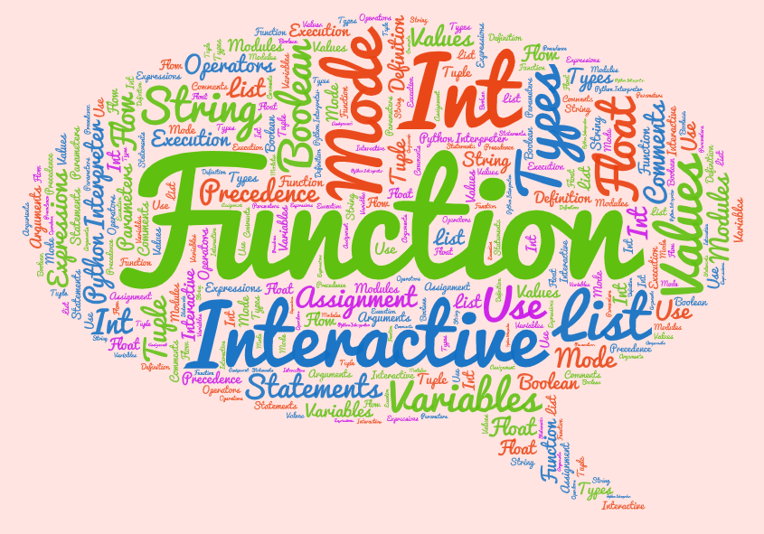
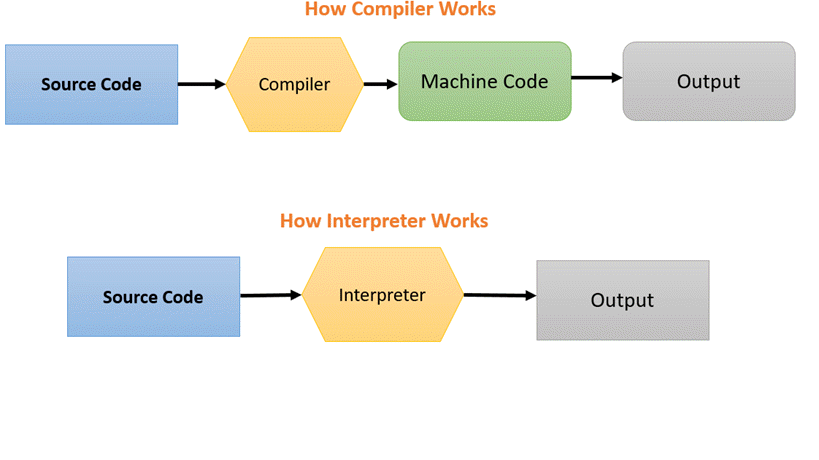
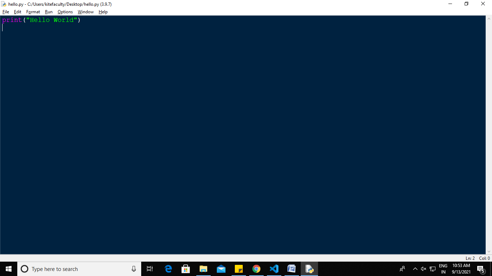
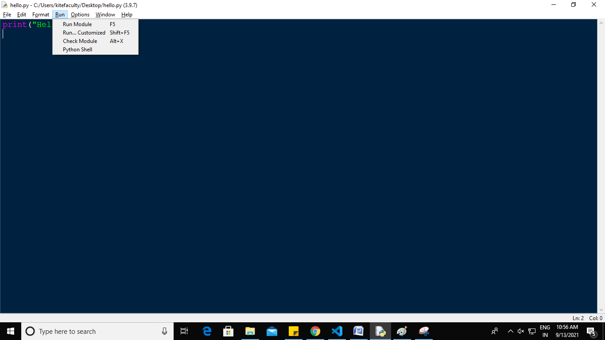

# **<center> GE8151 PROBLEM SOLVING AND PYTHON PROGRAMMING </center>**

## <center>**UNIT II DATA, EXPRESSIONS, STATEMENTS**</center>
<div align="justify"><p><i>Python interpreter and interactive mode; values and types: int, float, boolean, string, and list; variables, expressions, statements, tuple assignment, precedence of operators, comments; modules and functions, function definition and use, flow of execution, parameters and arguments;</div></p></i>
<p><div align="justify"><b><i>Illustrative programs: exchange the values of two variables, circulate the values of n variables, distance between two points.</b></i></p>

>## **Table of Contents**
***
1. UNIT II DATA, EXPRESSIONS, STATEMENTS
    * Key Terms
    * Introduction to Python
    * Python interpreter 
    * Interactive mode
>## **Pre – Unit Exercise**
***
<div align="justify">A simple game to get a clear view on different data values. </div>

>## **Post – Unit Exercise**
***
* <div align="justify">Solve various complex mathematical expressions through python programming. </div>
* <div align="justify">Implement applications through functions and methods. </div>
>## **Key Terms**
***
* <p><div align="justify"><b><i>Interpreter</b></i>: An interpreter is a computer program that is used to directly execute program instructions written using one of the many high-level programming languages. </div></p>
* <p><div align="justify"><b><i>Data types</b></i>are the classification or categorization of data items. It represents the kind of value that tells what operations can be performed on a particular data. </div></p>
* <div align="justify"><b><i><p>Variables</b></i> are reserved memory locations to store values. Based on the data type of a variable, the interpreter allocates memory and decides what can be stored in the reserved memory. </div></p>
* <p><div align="justify"><b><i>Tuple</b></i> is a collection of objects which ordered and immutable. Creating a tuple is as simple as putting different comma-separated values. </div></p>
* <p><div align="justify"><b><i>Comments</b></i> in Python are the lines in the code that are ignored by the compiler during the execution of the program. Comments enhance the readability of the code and help the programmers to understand the code very carefully. </div></p>
* <p><div align="justify"><b><i>Operators</b></i>in general are used to perform operations on values and variables. These are standard symbols used for the purpose of logical and arithmetic operations. </div></p>
* <p><div align="justify"><b><i>Operator precedence</b></i> determines how operators are parsed concerning each other. Operators with higher precedence become the operands of operators with lower precedence. </div></p>
* <p><div align="justify"><b><i>Function</b></i> is a block of organized, reusable code that is used to perform a single, related action. Functions provide better modularity for your application and a high degree of code reusing.   </div></p>

>## **Python Interpreter**
***
## **<u>Introduction to Python</u>**
<p><div align="justify">Python is an interpreted high-level general-purpose programming language. Its design philosophy emphasizes code readability with its use of significant indentation.</div></p>

<div align="justify">It was created by Guido van Rossum during <b><i>1985-1990</b></i>. Python got its name from <b><i>“Monty Python’s flying circus”</b></i>. Python was released in the year 2000.</div>

* <p><div align="justify"><b><i>Python is interpreted: </b></i> Python is processed at runtime by the interpreter. You do not need to compile your program before executing it. </div></p>
* <p><div align="justify"><b><i>Python is Interactive: </b></i> You can actually sit at a Python prompt and interact with the interpreter directly to write your programs. </div></p>
* <p><div align="justify"><b><i>Python is Object-Oriented: </b></i> Python supports Object-Oriented style or technique of programming that encapsulates code within objects. </div></p>
* <p><div align="justify"><b><i>Python is a Beginner's Language: </b></i> Python is a great language for the beginner- Level programmers and supports the development of a wide range of applications.</div> </p>
## **<u>Python Features</u>**
* <p><div align="justify"> <b><i>Easy-to-learn: </b></i> Python is clearly defined and easily readable. The structure of the program is very simple. It uses few keywords. </div></p>
* <p><div align="justify"> <b><i>Easy-to-maintain:</b></i> Python's source code is fairly easy-to-maintain. </p></div>
* <p><div align="justify"> <b><i>Portable:</b></i> Python can run on a wide variety of hardware platforms and has the same interface on all platforms. </div></p>
* <p><div align="justify"><b><i>Interpreted:</b></i> Python is processed at runtime by the interpreter. So, there is no need to compile a program before executing it. You can simply run the program. </div></p>
* <p><div align="justify"><b><i>Extensible:</b></i> Programmers can embed python within their C, C++, JavaScript, ActiveX, etc.</div></p> 
* <p><div align="justify"><b><i>Free and Open Source: </b></i> Anyone can freely distribute it, read the source code, and edit it. </div></p>
* <p><div align="justify"><b><i> High Level Language: </b></i> When writing programs, programmers concentrate on solutions of the current problem, no need to worry about the low level details. </div></p>
* <p><div align="justify"><b><i>Scalable:</b></i> Python provides a better structure and support for large programs than shell scripting.</div></p>

## **<u> Python interpreter</u>**
<p><div align="justify"> <b><i>Interpreter:</b></i> An interpreter is a translator (computer program) that repeatedly reads instructions (one at a time) and translates them to machine code. It then executes instructions written in a programming or scripting language, without requiring them previously to have been compiled into a machine language program. </div></p>

<div align="justify"> <b><i>Compiler:</b></i> To translate a program written in a high-level language into a low-level language all at once, in preparation for later execution. </div> </p>


## **<u> Difference between Compiler and Interpreter</u>**
| Compiler | Interpreter |
| --- | ----------- |
| <div align="justify"> Scans the entire program and translates it as a whole into machine code. </div> | <div align="justify">Translates program one statement at a time. </div>|
| <div align="justify"> It takes large amount of time to analyze the source code but the overall execution time is comparatively faster. </div> | <div align="justify"> It takes less amount of time to analyze the source code but the overall execution time is slower. </div> |
| <div align="justify"> Generates intermediate object code which further requires linking, hence requires more memory. </div> | <div align="justify"> No intermediate object code is generated, hence are memory efficient. </div> |
| <div align="justify"> It generates the error message only after scanning the whole program. Hence debugging is comparatively hard. </div> | <div align="justify"> Continues translating the program until the first error is met, in which case it stops. Hence debugging is easy. </div>|
| <div align="justify"> Programming language like C, C++ uses compilers. </div> | <div align="justify"> Programming languages like Python, Ruby use interpreters. </div> |
## **Modes of Python Interpreter** 
Python has two basic modes: script and interactive.

###  **_1. Interactive Mode:_**
<p><div align="justify">Interactive mode is a command line shell which gives immediate feedback for each statement, while running previously fed statements in active memory. As new lines are fed into the interpreter, the fed program is evaluated both in part and in whole.</div></p>
<p><div align="justify">The code executes via the Python shell, which comes with Python installation. Interactive mode is handy when you just want to execute basic Python commands or you are new to Python programming. </div></p>
<p><div align="justify">To access the Python shell, open the terminal of your operating system and then type "python". Press the enter key and the Python shell will appear.</div></p>


<p><div align="justify"> The >>> indicates that the Python shell is ready to execute and send your commands to the Python interpreter. The result is immediately displayed on the Python shell as soon as the Python interpreter interprets the command. </div></p>
<p><div align="justify">To run your Python statements, just type them and hit the enter key. You will get the results immediately, unlike in script mode. For example, to print the text "Hello World", we can type the following:</div></p>

```python
>>> print("Hello World")
Hello World
```

```python
>>> 10
10
>>> print(5*20)
100
>>> "hi" * 5
'hihihihihi'
>>>
``` 
<div align="justify"> It is possible to run multiple Python statements without having to create and save a script. You can also copy your code from another source then paste it on the Python shell. </div>

```python
>>> the_world_is_flat = True
>>> if the_world_is_flat:
        print("Be careful not to fall off!")

Be careful not to fall off
```
### <b><i>Advantages of Interactive Mode</b></i>
* <p><div align="justify"> Helpful when the script is extremely short and wants immediate results. </div></p>
* <p><div align="justify"> Faster as you only have to type a command and then press the enter key to get the results. </div></p>
* <p><div align="justify"> Good for beginners who need to understand Python basics. </div></p>
### **_Disadvantages of Interactive Mode_**
* <p><div align="justify"> Editing the code in interactive mode is hard to move back to the previous commands or else the whole command has to be rewritten again. </div></p>
* <p><div align="justify"> It's very tedious to run long pieces of code. </div><p>
### **_2. Script Mode:_**
<p><div align="justify"> In script mode, we type python program in a file and then use interpreter to execute the content of the file. Scripts can be saved to disk for future use. Python scripts have the extension .py, meaning that the filename ends with     <i><b>.py</i></b>. Save the code with <i><b>filename.py</i></b> and run the interpreter in script mode to execute the script. </div></p>
<p><div align="justify"> In the standard Python shell, click <i><b>"File"</i></b> then choose <i><b>"New"</i></b> or simply hit <i><b>"Ctrl + N"</i></b> on your keyboard to open a blank script in which you can write your code. You can then press <i><b>"Ctrl + S"</i></b> to save it. </div><p>
<p><div align="justify"> After writing your code, run it by clicking <i><b>"Run"</i></b> then "Run Module" or simply <i><b>press F5</i></b>. </div><p>






### **_Advantages of Script Mode_**
* It is easy to run large pieces of code.
* Editing your script is easier in script mode.
* Good for both beginners and experts.
### **_Disadvantages of Script Mode_**
* Can be tedious when you need to run only a single or a few lines of code.
* Must create and save a file before executing your code.

>## **Values and Types**
***
## **Data Types**
<p><div align="justify">Data types are the <i>classification or categorization of data items</i>. Python supports the following built-in data types</div></p>

* Numeric
* Sequence Type
* Boolean
* Set
* Dictionary


## **Numeric Type**
## **_Integers_**
<p><div align="justify">This value is represented by int class. It contains positive or negative whole numbers (without fraction or decimal). In Python there is no limit to how long an integer value can be. The followings are valid integer literals in Python.</p></div>

``` python
>>> 0
0
>>> 100
100
>>> -10
10
>>> 1234567890
1234567890
>>>y=5000000000000000000000000000000000000000000000000000000
>>>y
5000000000000000000000000000000000000000000000000000000
```

<p><div align="justify">Integers can be binary, octal, and hexadecimal values.</p><div>

```python
>>> 0b11011000 # binary
216
>>> 0o12 # octal
10
>>> 0x12 # hexadecimal
15
```
<p><div align="justify">All integer literals or variables are objects of the int class. Use the type() method to get the class name, as shown below.</p></div>

```python
>>>type(100)
<class 'int'> 

>>> x=1234567890
>>> type(x)
<class 'int'> 

>>>y=5000000000000000000000000000000000000000000000000000000
>>> type(y) 
<class 'int'>
```
<p><div align="justify">Leading zeros in non-zero integers are not allowed e.g. 000123 is invalid number, 0000 is 0.</p></div>

```python
>>> 01234
  File "<stdin>", line 1
    01234
        ^
SyntaxError: leading zeros in decimal integer literals are not permitted; use an 0o prefix for octal integers
```
<p><div align="justify">Python does not allow comma as number delimiter. Use underscore _ as a delimiter instead.</p></div>

```python
>>> x=1_234_567_890
>>> x
1234567890
```
<p><div align="justify">The <b><i>int( )</b></i> function converts a string or float to int.</p></div>

```python
>>> int('100')
100
>>> int('-10')
-10
>>> int('5.5')
5
>>> int('100', 2)
4
```
## **_Boolean_**
<p><div align="justify">Data type with one of the two built-in values, True or False. Boolean objects that are equal to True are truthy (true), and those equal to False are falsy (false). But non-Boolean objects can be evaluated in Boolean context as well and determined to be true or false. It is denoted by the <b><i>class bool</b></i>.True and False with capital <b><i>‘T’ and ‘F’</b></i> are valid booleans otherwise python will throw an error.</p></div>

```python
>>>print(type(True))
<class 'bool'>
>>>print(type(False))
<class 'bool'>

print(type(true))
Traceback (most recent call last):
  File "<stdin>", line 1, in <module>
NameError: name 'true' is not defined
```
## **_Float_**
<p><div align="justify"> In Python, floating point numbers (float) are positive and negative real numbers with a fractional part denoted by the decimal symbol . or the scientific notation E or e, <b>e.g. 1234.56, 3.142, -1.55, 0.23.</b></p></div>

```python
>>> f=3.12
>>> f
3.12
>>> type(f)
<class 'float'>
```
<p><div align="justify">Floats can be separated by the underscore _, <b>e.g. 123_42.222_013</b> is a valid float.</p> </div>

```python
>>> f=123_42.222_013
>>> f
12342.222013
```
<p><div align="justify">Floats has the maximum size depends on your system. The float beyond its maximum size referred as <b>"inf", "Inf", "INFINITY", or "infinity".</b> <b> Float 2e400</b> will be considered as infinity for most systems.</p> </div>

```python
>>> f=2e400
>>> f
inf
```
## **_Complex Number_**
<p><div align="justify">A complex number is a number with real and imaginary components. For example, 5 + 6j is a complex number where 5 is the real component and 6 multiplied by j is an imaginary component.</p></div>

```python
>>> a=7+3j
>>> a
(7+3j)
>>> type(a)
<class 'complex'>
```
<p><div align="justify">You must use <b>j or J</b> as imaginary component. Using other character will throw syntax error.</p></div>

```python
>>> a=5+2k
SyntaxError: invalid syntax
>>> a=5+j
SyntaxError: invalid syntax
>>> a=5j+2j
SyntaxError: invalid syntax
```
## **Sequence Type**
<p><div align="justify">In Python, sequence is the ordered collection of similar or different data types. Sequences allows to store multiple values in an organized and efficient fashion. There are several sequence types in Python</p></div>

* String
* List
* Tuple
<p><div align="justify">In Python, string is an immutable sequence data type. It is the sequence of Unicode characters wrapped inside single, double, or triple quotes.</p></div>

```python
'This is a string in Python' # string in single quotes
"This is a string in Python" # string in double quotes
'''This is a string in Python''' # string in triple quotes
"""This is a string in Python""" # string in triple double-quotes
```
<b>Example:</b>

https://replit.com/@ErAmbikaM/String1#main.py

<p><div align="justify">Multi-line strings must be embed in triple quotes, as shown below.</p></div>
<b>Example:</b>

https://replit.com/@ErAmbikaM/Multiline-String#main.py

<p><div align="justify">Use the len() function to retrieve the length of a string, as shown below.</p></div>

```python
>>> wish='Hello'
>>> len(wish)
5
```
<p><div align="justify">In Python, individual characters of a String can be accessed by using the method of Indexing. </p></div>


```python
>>> wish='Hello'
>>> wish[0]
'H'
>>> wish[1]
'e'
>>> wish[4]
'o'
>>> wish[5]
Traceback (most recent call last):
  File "<pyshell#6>", line 1, in <module>
    wish[5]
IndexError: string index out of range
```
<p><div align="justify">Indexing allows negative address references to access characters from the back of the String, e.g. -1 refers to the last character, -2 refers to the second last character and so on.</p></div>

```python
>>> wish='Hello'
>>> wish[-5]
'H'
>>> wish[-2]
'l'
>>> wish[-3]
'l'
>>> wish[-6]
Traceback (most recent call last):
  File "<pyshell#13>", line 1, in <module>
    wish[-6]
IndexError: string index out of range
>>> 
```
<p><div align="justify">The string is an immutable object. Hence, it is not possible to modify it. The attempt to assign different characters at a certain index results in errors.</p></div>

```python
>>> wish='hello'
>>> wish[0]='B'
Traceback (most recent call last):
  File "<pyshell#26>", line 1, in <module>
    wish[0]='B'
TypeError: 'str' object does not support item assignment
```
<p><div align="justify">All strings are objects of the <b><i>str class</b></i> in Python.

```python
>>> wish='hello'
>>> type(wish)
<class 'str'>
```
### **_Escape Sequences_**
<p><div align="justify">The escape character is used to invoke an alternative implementation of the subsequent character in a sequence.</p></div>

```python
>>> str1='Welcome to \'Python Tutorial\' '
>>> print(str1)
Welcome to 'Python Tutorial' 

>>> str1='Welcome to \"Python Tutorial\" '
>>> print(str1)
Welcome to "Python Tutorial" 
```
| Escape Sequence | Description | Example |
| ----------- | ----------- | ----------- |
| <div align="center"> \\\ </div> | <div align="justify">Backslash </div>| <div>>>> "Hello\\Hi"</div> Hello\Hi   | 
| <div align="center"> \b </div> | <div align="justify">Backspace </div>| <div>>>> "ab\bc"</div> ac | 
| <div align="center"> \f </div> | <div align="justify">Form feed </div>|  | 
| <div align="center"> \n </div> | <div align="justify">Newline </div>| <div>>>> "hello\nworld"</div> <div>Hello </div>world | 
| <div align="center"> \nnn </div> | <div align="justify">Octal notation, where n is in the range 0-7 </div>| <div>>>> '\101'</div> A | 
| <div align="center"> \t </div> | <div align="justify">Tab </div>| <div> >>>'Hello\tPython'</div> Hello &nbsp; &nbsp; &nbsp; &nbsp; Python |
| <div align="center"> \xnn </div> | <div align="justify">Hexadecimal notation, where n is in the range 0-9, a-f, or A-F </div>| <div> >>> '\x48\x69'</div> Hi |
| <div align="center"> \onn </div> | <div align="justify">Octal notation, where n is in the range 0-9 </div>| <div> >>> "\110\151"</div> Hi 
